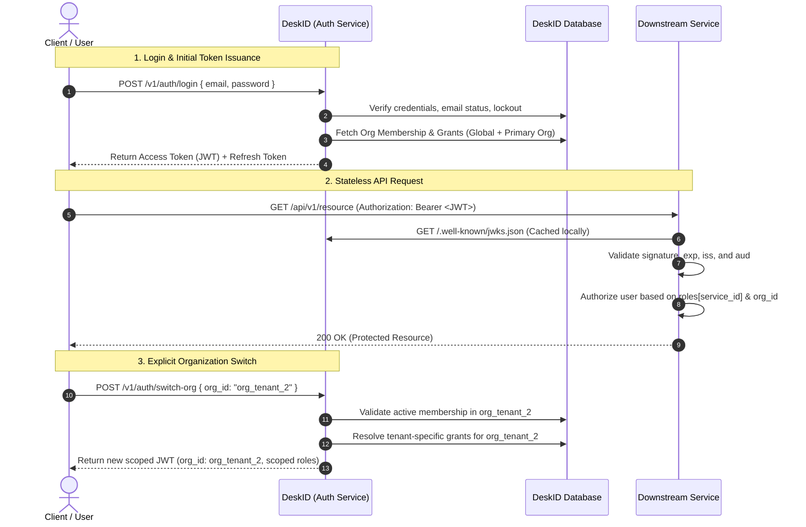
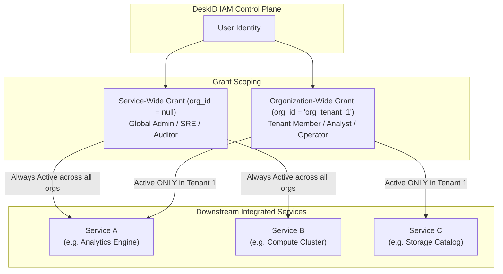

# DeskID

DeskID is a high-performance, product-agnostic authentication and identity microservice module. Consumer services validate JWTs via JWKS and assign product grants via admin API or deployment env.

## Features

- Email/password register & login with **email verification**
- **Password reset** via Mail service
- Google + GitHub OAuth
- RS256 access tokens + refresh tokens (rotation + revocation)
- Public JWKS (`/.well-known/jwks.json`) with deterministic key management
- Orgs / memberships (`org_id` / `workspace_id` claims)
- Product grants (`aud` + `roles.<product>`) — assigned per product, not baked into Auth
- **Rate limiting** on login, register, and password-reset endpoints
- **Immutable audit log** for all auth and admin events
- **User data export and deletion** (GDPR/CCPA)
- **Request-ID middleware** (`x-request-id` on every response)
- **Authenticated token introspection** (`/introspect` requires API key)

## Quick start

```bash
cd DeskID
python3 -m venv .venv && source .venv/bin/activate
pip install -e ".[dev]"
cp .env.example .env
# Edit .env — at minimum set AUTH_JWT_PRIVATE_KEY / AUTH_JWT_PUBLIC_KEY
deskid
# → http://127.0.0.1:8090
```

Generate an RSA key pair for local dev:

```bash
openssl genpkey -algorithm RSA -pkeyopt rsa_keygen_bits:2048 -out private.pem
openssl rsa -in private.pem -pubout -out public.pem
# Then set AUTH_JWT_PRIVATE_KEY_FILE=./private.pem and AUTH_JWT_PUBLIC_KEY_FILE=./public.pem
```

OpenAPI: http://127.0.0.1:8090/docs

## Integrate from another product

1. Send users to Auth login API or OAuth start URLs
2. Receive `access_token` (Bearer JWT)
3. Validate locally with JWKS (`iss`, `aud`, `exp`) — no call to Auth per request
4. Read claims: `sub`, `email`, `org_id`, `workspace_id`, `roles`
5. Ensure users have a **product grant** for your audience (`POST /v1/admin/grants` or `AUTH_DEFAULT_AUDIENCES` in that environment)

```bash
curl http://127.0.0.1:8090/.well-known/jwks.json
```

Example claims (after granting audience `myproduct`):

```json
{
  "sub": "user_uuid",
  "email": "dev@example.com",
  "org_id": "…",
  "workspace_id": "…",
  "aud": ["myproduct"],
  "roles": { "myproduct": "operator" },
  "iss": "https://auth.deskid.local"
}
```

## Enterprise IAM & Multi-Service Architecture

DeskID provides a centralized identity and access management control plane for all downstream integrated microservices across multi-tenant deployments.

### Authentication & Token Issuance Flow



---

### Service-Wide vs Organization-Wide Grants

Grants are managed centrally and scoped at two distinct levels:



1. **Service-Wide (Global Platform) Grants (`org_id = null`):**
   - Applied to an integrated service across the entire platform regardless of which organization context the user is currently operating in.
   - Typically used for platform operators, infrastructure administrators, and global security auditors.
   - Always included in `roles` and `aud` across all organization contexts.

2. **Organization-Wide (Tenant-Scoped) Grants (`org_id = "<org_id>"`):**
   - Applied to an integrated service **strictly within the boundary of that specific Organization**.
   - Allows fine-grained role separation (e.g. an admin on `service-a` in Tenant 1, but a viewer on `service-a` in Tenant 2).
   - Dynamically evaluated and bound to the JWT when the user activates or switches organizations via `POST /v1/auth/switch-org`.

---

### Audience Sets (`aud`) & Grant Resolution Rules

Every downstream service registered with DeskID is represented by a unique **Audience Identifier** (e.g. `service-a`, `service-b`, `service-c`).

When a token is requested or switched:

1. **Audience Inclusion (`aud`):**
   - The `aud` claim is automatically constructed from the set of all services where the user has an active grant in the current context:
     $$\text{aud} = [\text{"deskid"}, \text{service}_1, \text{service}_2, \dots]$$
   - Downstream services **must** reject tokens that do not list their specific audience in `aud`.

2. **Role Precedence & Overrides:**
   - Base global grants (`org_id = null`) are loaded first.
   - Organization-specific grants (`org_id = active_org_id`) take precedence and override global defaults for matching services.
   - Services for which the user has no grant are excluded from `roles` and `aud`.

#### Example Token Payload:

```json
{
  "sub": "usr_948a28f1",
  "email": "user@company.internal",
  "org_id": "org_tenant_1",
  "workspace_id": "ws_production",
  "aud": ["deskid", "service-a", "service-b", "service-c"],
  "roles": {
    "service-a": "admin",
    "service-b": "operator",
    "service-c": "viewer"
  },
  "token_version": 1,
  "iss": "https://auth.company.internal",
  "iat": 1725634800,
  "exp": 1725635700
}
```

---

### Downstream Service Validation Checklist

When integrating any backend service with DeskID:

1. **Fetch & Cache Public Keys:** Retrieve the JWKS from `/.well-known/jwks.json`. Refresh automatically on unknown `kid` or after cache TTL.
2. **Stateless Verification:** Verify the token signature with the public key matching `header.kid`, ensuring:
   - `iss == AUTH_ISSUER`
   - `aud` contains your service's audience identifier (e.g. `"service-a"`)
   - `exp > current_timestamp`
3. **RBAC Enforcement:** Check `claims["roles"]["service-a"]` to enforce authorization (e.g. `admin`, `operator`, `viewer`).
4. **Tenant Isolation:** Filter data partitions, catalogs, or workspaces matching `claims["org_id"]`.

## Zero-Downtime Key Rotation (JWKS Key Ring)

DeskID supports continuous zero-downtime RSA key rotation:
- The active signing key is configured via `AUTH_JWT_PRIVATE_KEY` / `AUTH_JWT_PUBLIC_KEY`.
- Previous/historical public verification keys can be supplied via `AUTH_JWT_PREVIOUS_PUBLIC_KEYS` (JSON array/map) or `AUTH_JWT_PREVIOUS_PUBLIC_KEYS_FILE`.
- `/.well-known/jwks.json` advertises all active and historical keys simultaneously.
- When validating tokens, DeskID inspects the unverified `kid` header and matches against the full key ring.

## Downstream Reconciliation Event Feed

Downstream services can maintain synchronized local caches of user status, organization lifecycle, and grant assignments by polling the chronological reconciliation feed:

```bash
GET /v1/admin/reconciliation/events?since_id=<event_id>&limit=50
```

Returns:
```json
{
  "events": [
    {
      "id": "evt_01",
      "occurred_at": "2026-09-06T12:00:00Z",
      "action": "admin.set_grant",
      "resource_type": "product_grant",
      "resource_id": "usr_123",
      "previous_hash": "GENESIS",
      "integrity_hash": "e3b0c44298fc1c149afbf4c8996fb92427ae41e4649b934ca495991b7852b855",
      "details": "{\"audience\": \"service-a\", \"role\": \"admin\", \"org_id\": \"org_tenant_1\"}"
    }
  ],
  "next_cursor": "evt_01",
  "has_more": false
}
```

## Cryptographic Audit Log & Offline Verification

All security events are cryptographically chained using SHA-256 (`previous_hash` $\rightarrow$ `integrity_hash`).

To verify chain integrity offline or from the database:

```bash
# Verify from live database:
AUTH_DATABASE_URL="postgresql+psycopg://..." python3 scripts/verify_audit_chain.py

# Verify from exported JSON:
python3 scripts/verify_audit_chain.py --file audit_export.json
```

## OAuth setup

Create Google / GitHub OAuth apps. Redirect URIs:

- `http://localhost:8090/v1/oauth/google/callback`
- `http://localhost:8090/v1/oauth/github/callback`

```bash
AUTH_GOOGLE_CLIENT_ID=…
AUTH_GOOGLE_CLIENT_SECRET=…
AUTH_GITHUB_CLIENT_ID=…
AUTH_GITHUB_CLIENT_SECRET=…
AUTH_SPA_CALLBACK_URL=http://localhost:5173/auth/callback
```

## Docker

```bash
docker compose up -d
```

Postgres + Auth on port 8090. Mount RSA PEMs as `./private.pem` and `./public.pem` (or set `AUTH_JWT_*_KEY_FILE` on the host). Set `AUTH_ISSUER` and `AUTH_BOOTSTRAP_TOKEN`.

## Admin console

Platform admins can operate users, grants, and the audit log in the browser:

http://127.0.0.1:8090/admin/console

## Protocol shape

Auth is a first-party JSON + RS256 JWT API, **not** an OpenID Connect authorization server. Products validate JWKS locally. Standard OIDC clients (discovery, authorization-code, PKCE) are a non-goal until explicitly scheduled.

Rate limits are per process. Run a single replica or put a shared limiter in front until a Redis/Cache backend is added.

## API map

| Method | Path | Auth | Purpose |
|--------|------|------|---------|
| GET | `/health` | none | Ready check (HTTP 503 when DB or keys fail) |
| GET | `/admin/console` | browser | Platform-admin UI |
| POST | `/v1/auth/register` | none | Email/password signup |
| POST | `/v1/auth/login` | none | Password login |
| POST | `/v1/auth/refresh` | none | Rotate refresh token |
| POST | `/v1/auth/logout` | none | Revoke refresh token |
| GET | `/v1/auth/me` | Bearer JWT | Current user profile |
| PATCH | `/v1/auth/me` | Bearer JWT | Update profile (email change re-verifies) |
| POST | `/v1/auth/me/change-password` | Bearer JWT | Change password; revokes other sessions |
| GET | `/v1/auth/me/sessions` | Bearer JWT | List refresh sessions |
| DELETE | `/v1/auth/me/sessions` | Bearer JWT | Revoke all sessions |
| DELETE | `/v1/auth/me/sessions/{id}` | Bearer JWT | Revoke one session |
| POST | `/v1/auth/verify-email` | none | Verify email with token |
| POST | `/v1/auth/forgot-password` | none | Request password reset email |
| POST | `/v1/auth/reset-password` | none | Reset password with token |
| GET | `/v1/oauth/google/start` | none | Initiate Google OAuth |
| GET | `/v1/oauth/github/start` | none | Initiate GitHub OAuth |
| GET | `/.well-known/jwks.json` | none | Public JWKS |
| POST | `/introspect` | API key | Token introspection |
| GET | `/metrics` | none | In-process auth counters |
| GET/POST | `/v1/orgs` | Bearer JWT | List/create orgs |
| DELETE | `/v1/orgs/{id}` | Bearer JWT | Delete org (owner) |
| GET | `/v1/orgs/{id}/members` | Bearer JWT | List members |
| POST | `/v1/orgs/{id}/members` | Bearer JWT | Add/update member |
| DELETE | `/v1/orgs/{id}/members/{user_id}` | Bearer JWT | Remove member |
| GET | `/v1/me/export` | Bearer JWT | Export own data (GDPR) |
| POST | `/v1/me/delete` | Bearer JWT | Delete own account (GDPR) |
| GET | `/v1/admin/users` | Bearer JWT + admin | List/search users (`q`, `limit`, `offset`) |
| PATCH | `/v1/admin/users/{id}/active` | Bearer JWT + admin | Suspend or activate |
| POST | `/v1/admin/grants` | Bearer JWT + admin | Assign product grant |
| GET | `/v1/admin/audit` | Bearer JWT + admin | Query audit log |

## TypeScript SDK

```typescript
import { DeskID } from './client'

const auth = new DeskID({ baseUrl: 'http://127.0.0.1:8090' })

// Auth flows
await auth.register({ email, password })
await auth.login({ email, password })
await auth.refresh(refreshToken)
await auth.logout(refreshToken)
await auth.me(accessToken)

// Email / password management
await auth.verifyEmail({ token })
await auth.forgotPassword({ email })
await auth.resetPassword({ token, password })

// Self-service (GDPR)
await auth.exportMyData(accessToken)
await auth.deleteMyAccount(accessToken)

// Admin
await auth.listUsers(accessToken)
await auth.setGrant(accessToken, { user_id, audience, role })
await auth.queryAuditLog(accessToken, { action: 'user.login', limit: 25 })
```

## Running tests

```bash
pytest tests/ -v
```
