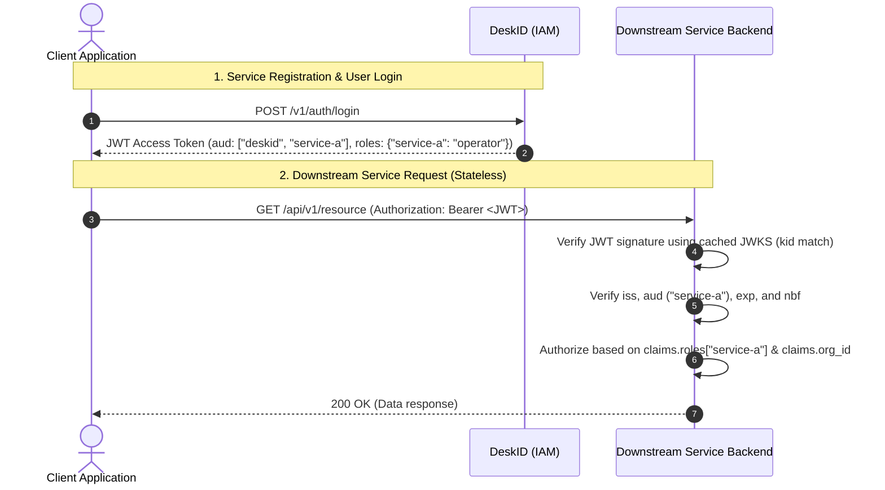

# DeskID Downstream Product & Service Onboarding Guide

> **Audience:** Backend engineers, microservice architects, and platform operators.  
> **Target System:** DeskID Authentication & Identity Engine (`deskid`).  
> **Status:** Production Standard.

---

## 1. Overview & Architecture Philosophy

DeskID is a product-agnostic, centralized identity control plane. Consumer and downstream services do not manage user databases, password hashes, or session tables. Instead:

1. **Stateless Verification:** Downstream services validate RS256 JWTs locally using public keys fetched from DeskID's JWKS (`/.well-known/jwks.json`). **No HTTP calls to DeskID are made during individual user requests.**
2. **Audience-Restricted Tokens:** Tokens issued by DeskID specify an `aud` claim containing all service IDs the user is authorized to access. Downstream services strictly reject tokens that do not contain their service audience.
3. **Custom Service Roles:** Each service defines its own allowed role taxonomy (e.g. `catalog-admin`, `data-reader`, `pipeline-runner`), which DeskID enforces and packages into the JWT under `claims["roles"][<service_id>]`.
4. **Dual-Tier Tenancy:** DeskID supports both platform-wide (global) grants and organization-scoped (tenant) grants, allowing downstream services to enforce tenant isolation and role separation effortlessly.



---

## 2. Step 1: Register Your Service & Custom Role Taxonomy

Before your service can accept DeskID tokens, it must be registered in DeskID's **Service Registry**.

### Option A: Using the Hosted Admin Console
1. Navigate to `http://127.0.0.1:8090/admin/console` and sign in with a platform-admin account.
2. Click the **Services** tab in the sidebar navigation.
3. Click **+ Register service**.
4. Fill in:
   - **Audience ID:** A slug identifying your service (e.g. `analytics-engine`, `storage-api`).
   - **Service Name:** Human-readable name (e.g. `Analytics Engine`).
   - **Allowed Roles:** Comma-separated list of valid roles (e.g. `admin, analyst, viewer`).
   - **Default Role:** The role automatically assigned when granting access without an explicit role (must be one of the allowed roles).
5. Click **Create service**.

### Option B: Using the Admin REST API
Send an authenticated request (`Bearer <platform_admin_jwt>`):

```bash
curl -X POST http://127.0.0.1:8090/v1/admin/services \
  -H "Authorization: Bearer $ADMIN_TOKEN" \
  -H "Content-Type: application/json" \
  -d '{
    "id": "analytics-engine",
    "name": "Analytics Engine",
    "description": "Distributed query and reporting engine",
    "allowed_roles": ["admin", "analyst", "viewer"],
    "default_role": "viewer"
  }'
```

**Response (`201 Created`):**
```json
{
  "id": "analytics-engine",
  "name": "Analytics Engine",
  "description": "Distributed query and reporting engine",
  "allowed_roles": ["admin", "analyst", "viewer"],
  "default_role": "viewer",
  "created_at": "2026-09-23T12:00:00Z",
  "updated_at": "2026-09-23T12:00:00Z"
}
```

### Option C: Using the TypeScript SDK
```typescript
import { DeskID } from './client'

const auth = new DeskID({ baseUrl: 'http://127.0.0.1:8090' })

const result = await auth.registerService(adminToken, {
  id: 'analytics-engine',
  name: 'Analytics Engine',
  description: 'Distributed query and reporting engine',
  allowed_roles: ['admin', 'analyst', 'viewer'],
  default_role: 'viewer'
})
```

---

## 3. Step 2: Configure Grants & Global Access

Users can only access your service if they hold a **Product Grant** for your service ID.

### 1. Default Grants for All New Users
To automatically grant all newly registered users access to your service, add your audience to the DeskID environment configuration:

```env
# .env in DeskID deployment
AUTH_DEFAULT_AUDIENCES="deskid,analytics-engine"
AUTH_DEFAULT_ROLE="viewer"
```

### 2. Explicit User Grants (Platform-Wide or Organization-Scoped)
To grant an individual user access or assign elevated roles:

```bash
# Platform-Wide Grant (effective across all organizations):
curl -X POST http://127.0.0.1:8090/v1/admin/grants \
  -H "Authorization: Bearer $ADMIN_TOKEN" \
  -H "Content-Type: application/json" \
  -d '{
    "user_id": "usr_948a28f1",
    "audience": "analytics-engine",
    "role": "analyst",
    "org_id": null
  }'

# Organization-Scoped Grant (effective only within org_tenant_1):
curl -X POST http://127.0.0.1:8090/v1/admin/grants \
  -H "Authorization: Bearer $ADMIN_TOKEN" \
  -H "Content-Type: application/json" \
  -d '{
    "user_id": "usr_948a28f1",
    "audience": "analytics-engine",
    "role": "admin",
    "org_id": "org_tenant_1"
  }'
```

*Note: If `role` is omitted in the grant request, DeskID will automatically resolve it to your service's configured `default_role`.*

---

## 4. Step 3: Implement Stateless Backend Token Verification

Your backend service must validate incoming JWTs locally without making round-trip network calls to DeskID.

### Verification Checklist:
1. **Fetch & Cache Public Keys:** Retrieve the JWKS from `http://<deskid-host>:8090/.well-known/jwks.json`.
   - Cache keys in-memory.
   - If an incoming token specifies a `kid` not present in your cache, refresh the cache once before rejecting.
2. **Cryptographic Signature:** Validate the RS256 signature using the public key matching `header.kid`.
3. **Issuer (`iss`):** Validate that `iss` strictly matches DeskID's configured `AUTH_ISSUER` (e.g. `https://auth.company.internal`).
4. **Audience (`aud`):** Validate that your service ID (e.g. `"analytics-engine"`) is in the `aud` array.
5. **Expiration (`exp`):** Validate `exp > current_timestamp`.
6. **Role Extraction:** Extract the user's role for your service from `claims["roles"]["<your_service_id>"]`.
7. **Tenant Scoping:** Use `claims["org_id"]` and `claims["workspace_id"]` to isolate multi-tenant database queries.

### Example Token Payload:
```json
{
  "sub": "usr_948a28f1",
  "email": "analyst@example.com",
  "org_id": "org_tenant_1",
  "workspace_id": "ws_analytics",
  "aud": ["deskid", "analytics-engine"],
  "roles": {
    "analytics-engine": "analyst"
  },
  "token_version": 1,
  "iss": "https://auth.company.internal",
  "iat": 1725634800,
  "exp": 1725638400
}
```

---

## 5. Backend Implementation Examples

### Python (FastAPI + PyJWT)

```python
import jwt
from jwt import PyJWKClient
from fastapi import FastAPI, Depends, HTTPException, Security
from fastapi.security import HTTPBearer, HTTPAuthorizationCredentials

AUTH_ISSUER = "https://auth.company.internal"
JWKS_URL = "http://deskid:8090/.well-known/jwks.json"
SERVICE_AUDIENCE = "analytics-engine"

jwks_client = PyJWKClient(JWKS_URL)
security = HTTPBearer()
app = FastAPI()

def get_current_user_claims(credentials: HTTPAuthorizationCredentials = Security(security)) -> dict:
    token = credentials.credentials
    try:
        signing_key = jwks_client.get_signing_key_from_jwt(token)
        claims = jwt.decode(
            token,
            signing_key.key,
            algorithms=["RS256"],
            issuer=AUTH_ISSUER,
            audience=SERVICE_AUDIENCE,
        )
    except Exception as e:
        raise HTTPException(status_code=401, detail=f"Invalid token: {e}")

    # Verify role assignment
    user_roles = claims.get("roles", {})
    if SERVICE_AUDIENCE not in user_roles:
        raise HTTPException(status_code=403, detail="No granted role for this service")

    return claims

@app.get("/api/v1/reports")
def list_reports(claims: dict = Depends(get_current_user_claims)):
    role = claims["roles"][SERVICE_AUDIENCE]
    org_id = claims.get("org_id")
    user_id = claims["sub"]
    return {
        "user_id": user_id,
        "org_id": org_id,
        "role": role,
        "reports": ["sales_q3", "marketing_attribution"]
    }
```

### Node.js / TypeScript (Express + `jwks-rsa`)

```typescript
import express, { Request, Response, NextFunction } from 'express'
import jwt from 'jsonwebtoken'
import jwksClient from 'jwks-rsa'

const SERVICE_AUDIENCE = 'analytics-engine'
const AUTH_ISSUER = 'https://auth.company.internal'

const client = jwksClient({
  jwksUri: 'http://deskid:8090/.well-known/jwks.json',
  cache: true,
  rateLimit: true,
  jwksRequestsPerMinute: 10
})

function getKey(header: jwt.JwtHeader, callback: jwt.SigningKeyCallback) {
  client.getSigningKey(header.kid, (err, key) => {
    callback(err, key?.getPublicKey())
  })
}

export function requireAuth(req: Request, res: Response, next: NextFunction) {
  const authHeader = req.headers.authorization
  if (!authHeader?.startsWith('Bearer ')) {
    return res.status(401).json({ error: 'Missing or malformed Authorization header' })
  }

  const token = authHeader.split(' ')[1]
  jwt.verify(
    token,
    getKey,
    { audience: SERVICE_AUDIENCE, issuer: AUTH_ISSUER, algorithms: ['RS256'] },
    (err, decoded: any) => {
      if (err) return res.status(401).json({ error: 'Token validation failed', details: err.message })

      const role = decoded.roles?.[SERVICE_AUDIENCE]
      if (!role) return res.status(403).json({ error: 'No permissions for this service' })

      req.user = decoded
      req.userRole = role
      req.orgId = decoded.org_id
      next()
    }
  )
}
```

---

## 6. Step 4: Real-Time Synchronization via Reconciliation Feed

If your service caches local permissions, usernames, or tenant memberships, you must synchronize state changes using DeskID's **chronological reconciliation feed**.

### Polling Endpoint:
```bash
GET /v1/admin/reconciliation/events?since_id=<last_processed_event_id>&limit=100
```
*(Requires Platform Admin token or dedicated service API key).*

### Example Feed Response:
```json
{
  "events": [
    {
      "id": "evt_0191c49b-7341-7a2e-839f-7f722a48bc92",
      "occurred_at": "2026-09-23T14:32:00Z",
      "action": "admin.set_grant",
      "resource_type": "product_grant",
      "resource_id": "usr_948a28f1",
      "previous_hash": "a4f89d...01",
      "integrity_hash": "e3b0c4...85",
      "details": {
        "audience": "analytics-engine",
        "role": "admin",
        "org_id": "org_tenant_1"
      }
    },
    {
      "id": "evt_0191c49c-8510-7b3f-912b-3129ba04a112",
      "occurred_at": "2026-09-23T14:35:10Z",
      "action": "user.delete",
      "resource_type": "user",
      "resource_id": "usr_b287ac99",
      "previous_hash": "e3b0c4...85",
      "integrity_hash": "c88f19...2a",
      "details": {
        "email": "deleted_user@example.com"
      }
    }
  ],
  "next_cursor": "evt_0191c49c-8510-7b3f-912b-3129ba04a112",
  "has_more": false
}
```

### Downstream Synchronization Loop:
1. Store the last processed `next_cursor` in your local database.
2. Poll `GET /v1/admin/reconciliation/events?since_id=<last_cursor>` periodically (e.g. every 10–30 seconds) or when webhook notifications fire.
3. Handle event types:
   - `admin.set_grant`: Update user's role in your local database for `details.audience`.
   - `admin.suspend_user` / `admin.activate_user`: Toggle user's active status.
   - `user.delete`: Purge or anonymize user-owned resources (GDPR compliance).
   - `org.delete` / `org.remove_member`: Invalidate cached tenant sessions.

---

## 7. Zero-Downtime Key Rotation Runbook

DeskID supports continuous cryptographic key rotation without service downtime:
1. DeskID advertises both current and historical keys on `/.well-known/jwks.json`.
2. When rotating signing keys:
   - Your service's JWKS client will receive the new `kid` in token headers.
   - Your client must automatically fetch the updated JWKS and verify the token.
   - Tokens signed by the previous key remain valid until their expiration (`exp`).
3. Ensure your local JWKS cache has a minimum TTL of **5 minutes** or implements cache invalidation on unknown `kid`.

---

## 8. Pre-Flight Integration Checklist

Before promoting your integration to production, verify the following:

- [ ] Service audience ID registered in DeskID via `POST /v1/admin/services` or Admin Console.
- [ ] Allowed roles taxonomy and default role defined.
- [ ] Backend JWKS client configured with automatic `kid` refresh.
- [ ] Backend checks `iss`, `aud`, `exp`, and `claims["roles"][service_id]`.
- [ ] Data queries partition by `claims["org_id"]` for multi-tenant isolation.
- [ ] Tokens with missing or unexpected audience are rejected with `401/403`.
- [ ] Synchronization worker configured to consume `/v1/admin/reconciliation/events` (if maintaining local state).
