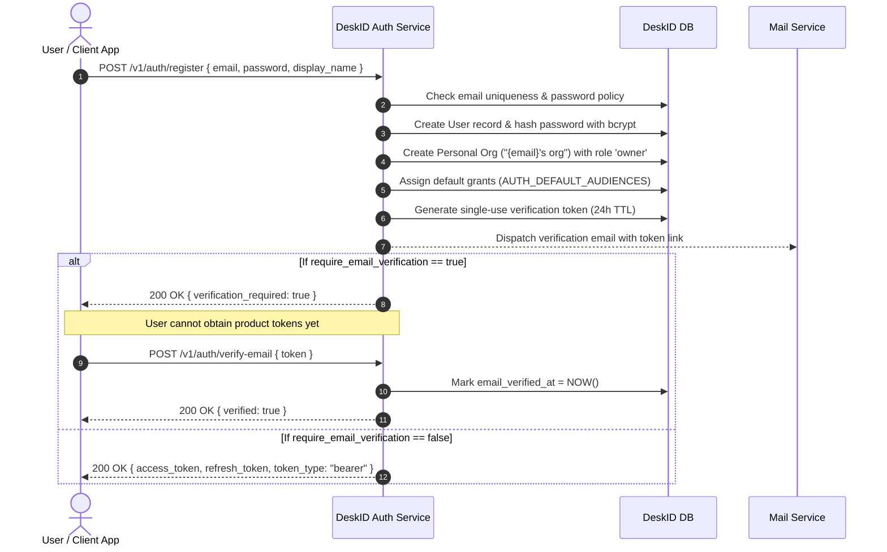

# DeskID User Onboarding & Identity Lifecycle Guide

> **Audience:** Platform administrators, security engineers, and support operators.  
> **Target System:** DeskID Authentication & Identity Engine (`deskid`).  
> **Status:** Production Standard.

---

## 1. Overview of Identity & Tenant Lifecycle

Every user account in DeskID is governed by a unified identity model:
- **Authentication Credentials:** Securely hashed with `bcrypt` (or federated via OAuth).
- **Organization Tenancy:** Every user owns an automatic personal organization (`"{email}'s org"`) upon signup and can belong to multiple collaborative organizations with distinct roles (`owner`, `admin`, `member`).
- **Product Grants:** Authorization is decoupled from user creation. Permissions across downstream applications are represented as **Product Grants** (`audience`, `role`, optional `org_id`).
- **Email Verification & Account Security:** Configurable account lockout, email verification gating, and single-use refresh token rotation.

---

## 2. Bootstrapping: Onboarding the First Platform Admin

When DeskID is freshly deployed and the database has zero user accounts (`SELECT COUNT(*) FROM users == 0`), the first registered user is automatically elevated to **Platform Admin** (`is_platform_admin = true`).

### Step-by-Step Bootstrap Process:

1. **Configure the Bootstrap Token:**
   In your production or staging `.env`:
   ```env
   AUTH_BOOTSTRAP_TOKEN="super-secret-bootstrap-token-change-me"
   AUTH_OPEN_REGISTRATION=false
   AUTH_REQUIRE_EMAIL_VERIFICATION=true
   ```

2. **Register the Initial Admin:**
   * **Via Hosted UI:** Visit `http://127.0.0.1:8090/auth#register`. Enter your email, password, and the **Bootstrap Token** in the provided field.
   * **Via REST API:**
     ```bash
     curl -X POST http://127.0.0.1:8090/v1/auth/register \
       -H "Content-Type: application/json" \
       -d '{
         "email": "admin@company.com",
         "password": "CorrectHorseBatteryStaple123!",
         "display_name": "Primary Admin",
         "bootstrap_token": "super-secret-bootstrap-token-change-me"
       }'
     ```

3. **Verify Email (if enabled):**
   If `AUTH_REQUIRE_EMAIL_VERIFICATION=true`, the registration endpoint returns:
   ```json
   { "verification_required": true }
   ```
   Retrieve the verification token (sent via email service or from the database/logs in local development) and submit:
   ```bash
   curl -X POST http://127.0.0.1:8090/v1/auth/verify-email \
     -H "Content-Type: application/json" \
     -d '{ "token": "raw_verification_token_here" }'
   ```

4. **Verify Admin Access:**
   Sign in to the Admin Console at `http://127.0.0.1:8090/admin/console` using your new platform-admin credentials.

---

## 3. User Registration Modes

DeskID supports two operational modes depending on whether your platform is an open SaaS or a controlled internal enterprise system.

### Mode A: Closed Enterprise Registration (Default & Recommended)
```env
AUTH_OPEN_REGISTRATION=false
```
* Arbitrary public user registrations are blocked (`HTTP 403: Registration is closed`).
* **Onboarding Path:** Platform administrators provision new users directly via the Admin API / Console, or users are invited into existing organizations.

### Mode B: Open Self-Service SaaS Registration
```env
AUTH_OPEN_REGISTRATION=true
```
* Any user can sign up via the hosted Auth UI or `POST /v1/auth/register`.
* The `bootstrap_token` field is not required.

---

## 4. End-User Registration & Provisioning Flow

When a user registers with DeskID:



### Password Policies:
DeskID enforces password rules at registration:
* Minimum length: `AUTH_PASSWORD_MIN_LENGTH=8`
* Uppercase requirement: `AUTH_PASSWORD_REQUIRE_UPPERCASE=false` (can be enabled)
* Numeric requirement: `AUTH_PASSWORD_REQUIRE_DIGIT=false` (can be enabled)

---

## 5. Organization Tenancy & Team Onboarding

DeskID provides multi-tenant organization capabilities out of the box.

### 1. Creating New Organizations
Users can create additional organizations beyond their personal default org:
```bash
curl -X POST http://127.0.0.1:8090/v1/orgs \
  -H "Authorization: Bearer $USER_TOKEN" \
  -H "Content-Type: application/json" \
  -d '{ "name": "Acme Data Labs" }'
```
The creating user is assigned the `owner` role.

### 2. Onboarding Members to an Organization
An organization `owner` or `admin` can add members to their team:
```bash
curl -X POST http://127.0.0.1:8090/v1/orgs/{org_id}/members \
  -H "Authorization: Bearer $USER_TOKEN" \
  -H "Content-Type: application/json" \
  -d '{
    "user_id": "usr_new_team_member",
    "role": "member"
  }'
```
Valid org roles:
* `owner`: Full control, can delete the organization, manage all members.
* `admin`: Can add/remove members, cannot delete org or demote owners.
* `member`: Regular organizational participant.

### 3. Switching Active Organization Context
When a user works across multiple organizations, downstream services need an access token scoped to the active tenant:
```bash
curl -X POST http://127.0.0.1:8090/v1/auth/switch-org \
  -H "Authorization: Bearer $USER_TOKEN" \
  -H "Content-Type: application/json" \
  -d '{ "org_id": "org_target_tenant" }'
```
DeskID verifies active membership in `org_target_tenant`, resolves tenant-specific product grants, and returns a new JWT with `claims.org_id` and tenant-scoped `roles`.

---

## 6. Social Login & SSO Onboarding (OAuth2)

DeskID supports Google and GitHub OAuth 2.0.

### Configuration (`.env`):
```env
AUTH_GOOGLE_CLIENT_ID="12345-abc.apps.googleusercontent.com"
AUTH_GOOGLE_CLIENT_SECRET="GOCSPX-..."
AUTH_GITHUB_CLIENT_ID="gh_client_id"
AUTH_GITHUB_CLIENT_SECRET="gh_client_secret"
AUTH_SPA_CALLBACK_URL="http://127.0.0.1:8090/auth"
```

### Social Account Linking Rules:
1. When a user logs in with OAuth for the first time, a new `User` record and linked `Identity` record are created.
2. If a password account already exists with the same email, DeskID links the social identity **only if the existing email is already verified** (`email_verified_at != null`). This prevents account takeover attacks via unverified third-party emails.
3. Access and refresh tokens are delivered securely via URL fragment (`#access_token=...&refresh_token=...`) to avoid leaking tokens in browser history and server access logs.

---

## 7. User Lifecycle & Operations Guide

### 1. Account Suspension & Reactivation
Platform administrators can immediately revoke access for compromised or departing users:
```bash
curl -X PATCH http://127.0.0.1:8090/v1/admin/users/{user_id}/active \
  -H "Authorization: Bearer $ADMIN_TOKEN" \
  -H "Content-Type: application/json" \
  -d '{ "is_active": false }'
```
* **Immediate Effect:** The user's `is_active` flag is set to `false`. Token refresh calls are rejected (`403 Forbidden`). All subsequent session rotations are blocked.
* Downstream services polling the `/v1/admin/reconciliation/events` feed receive an `admin.suspend_user` event to terminate downstream sessions immediately.

### 2. Password Reset Flow
If a user forgets their password:
1. **Request Reset Link:**
   ```bash
   POST /v1/auth/forgot-password { "email": "user@company.com" }
   ```
   A time-limited reset token (1-hour TTL) is generated and emailed to the user.
2. **Submit New Password:**
   ```bash
   POST /v1/auth/reset-password { "token": "...", "password": "NewSecurePassword123!" }
   ```
3. **Session Revocation:** Resetting the password automatically revokes all active refresh tokens and sessions, and increments `User.token_version`.

### 3. Account Lockout Protection
To guard against brute-force attacks:
* Default setting: `AUTH_ACCOUNT_LOCKOUT_MAX_ATTEMPTS=5`
* Lockout duration: `AUTH_ACCOUNT_LOCKOUT_DURATION_SECONDS=900` (15 minutes)
* After 5 consecutive failed password attempts, the account is temporarily locked. All subsequent login attempts return `401 Invalid credentials` until the lockout window expires.

### 4. Self-Service Data Privacy (GDPR / CCPA)
Users can export or delete their account data without administrative intervention:
* **Export My Data:**
  ```bash
  GET /v1/me/export
  ```
  Returns a comprehensive JSON document containing the user profile, identities, organization memberships, and granted permissions.
* **Delete My Account:**
  ```bash
  POST /v1/me/delete
  ```
  Initiates account termination, revokes all sessions, anonymizes audit entries, and handles owner succession in organizations.
